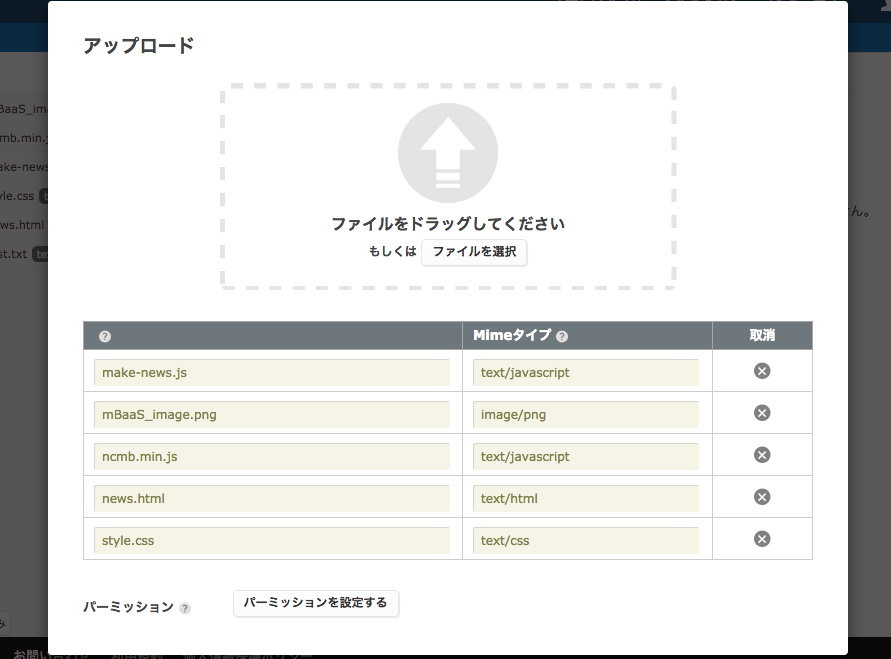
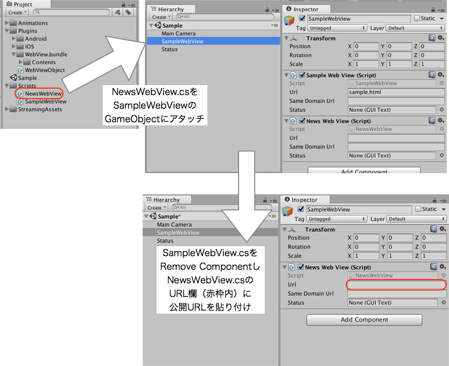
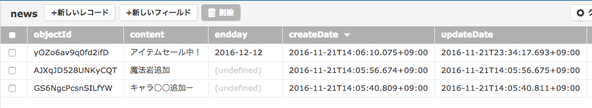

# 【Unity】アプリのお知らせ機能を作成しよう！


## 概要
* [ニフティクラウドmobile backend](http://mb.cloud.nifty.com/)の『ファイルストア』の公開ファイル機能を利用してUnityアプリにお知らせ機能を追加するサンプルコードです。
お知らせ機能にはグリー株式会社様が提供されている[WebViewプロジェクト](https://github.com/gree/unity-webview)をベースにそこに表示する情報をHTMLで構築します。

今回ご提供するGithubプロジェクトは上記のWebViewプロジェクトと組み合わせて利用する。[サンプルコード](https://github.com/hounenhounen/UnityNewsWebView)になります。

* [ニフティクラウドmobile backend](http://mb.cloud.nifty.com/)の機能を体験いただけます★☆

## ニフティクラウドmobile backendって何？？
スマートフォンアプリのバックエンド機能（プッシュ通知・データストア・会員管理・ファイルストア・SNS連携・位置情報検索・スクリプト）が**開発不要**、しかも基本**無料**(注1)で使えるクラウドサービス！今回はデータストアを体験します

注1：詳しくは[こちら](http://mb.cloud.nifty.com/price.htm)をご覧ください


## 動作環境
* Mac OS X 10.10.5(Yosemite)
* Unity ver. 5.4.2
* MonoDevelop-Unity ver. 5.9.6
* NCMB UnitySDK v2.2.0

※上記内容で動作確認をしています。

## 手順
### 流れ
1. [ニフティクラウドmobile backend](http://mb.cloud.nifty.com/)の会員登録とログイン→アプリ作成
2. グリー株式会社様の[WebView](https://github.com/gree/unity-webview)を利用したUnityアプリ作成
3. mobile backendにファイルストアにデータをアップロードし、公開ファイル設定を行う
4. HTMLファイルの公開URLをUnityのWebViewアプリに設定
5. お知らせ内容の作成
6. アプリをビルドする

### 1. [ニフティクラウドmobile backend](http://mb.cloud.nifty.com/)の会員登録とログイン→アプリ作成

* 上記リンクから会員登録（無料）をします。登録ができたらログインをすると下図のように「アプリの新規作成」画面が出るのでアプリを作成します


* アプリ作成されると下図のような画面になります
* この２種類のAPIキー（アプリケーションキーとクライアントキー）はXcodeで作成するiOSアプリに[ニフティクラウドmobile backend](http://mb.cloud.nifty.com/)を紐付けるために使用します


* 動作確認後に会員情報が保存される場所も確認しておきましょう


### 2. グリー株式会社様の[WebView](https://github.com/gree/unity-webview)を利用したUnityアプリ作成

プロジェクトをダウンロードし、Sampleのプロジェクトが表示されるようにしてください。（なお、筆者が試した環境ではEditor上にWebViewが表示できなかったため、動作確認はAndroid上にて行いました。）

### 3. mobile backendにファイルストアにデータをアップロードし、公開ファイル設定を行う

[お知らせ機能のサンプルプコード：UnityNewsWebViewプロジェクト](https://github.com/hounenhounen/UnityNewsWebView)をDLし,Fileフォルダないのファイルを全てニフティクラウドmobile backendのファイルストアにアップロードします。アップロードする際は下記の画面が表示されます。その後、公開ファイル設定を行ってください。




公開ファイル設定は[このブログ](http://qiita.com/natsumo/items/6edd296dd871f80c466a#4-ファイルの公開ファイルurlを取得と確認)を参考にしてください。

### 4. HTMLファイルの公開URLをUnityのWebViewアプリに設定
[UnityNewsWebViewプロジェクト](https://github.com/hounenhounen/UnityNewsWebView)の__`NewsWebView.cs`__のファイルをWebViewを表示するGameObjectにアタッチしてください。下記にグリー株式会社様の[WebView](https://github.com/gree/unity-webview)のサンプルを例に、アタッチする方法を記載しますのでそちらをご参考ください。


### 5.お知らせ内容の作成

今回の[UnityNewsWebViewプロジェクト](https://github.com/hounenhounen/UnityNewsWebView)ではお知らせ内容をデータストアに保存し、それをHTML上に書かれたJSSDKで引き出す形にしています。下記の画像のようにデータストア上に、__`news`__というクラスを作ってレコードを作成してください。




### 6. 動作確認
* Unity上で真ん中の実行ボタン（さんかくの再生マーク）をクリックもしくは、ビルドをすると下記のような画面が表示されます。


## 解説
サンプルコードに実装済みの内容のご紹介

### HTMLファイルの内容

今回のHTML（news.html）では下記のように同時にファイルストアにアップロードした各種のファイルを読み込んでいます。

読み込んでいるファイル
* style.css ・・・デザインを構築するCSSファイルです。
* ncmb.min.js ・・・ニフティクラウド mobile backendのJSSDKです。
* make-news.js ・・・SDKを元にHTMLを構築するスクリプトです。

make-news.jsが<div id="content">内にHTMLを構築します。

```html
<html>
<head>
	<meta charset="UTF-8">
	<link rel="stylesheet" type="text/css" href="./style.css" media="all">
  <script type="text/javascript" src="./ncmb.min.js"></script>
  <script type="text/javascript" src="./make-news.js"></script>
</head>
<body>

<div id="content">
    <h1>News!</h1>
</div>
</body>
</html>
```

### make-news.jsのロジック

make-news.jsで行っていることは主に以下の3つです。

1. DOMの読み込みが終了するまで、HTMLの構築を停止するロジック
2. データストアから掲示する情報を引き出し、表示
3. ファイルストアから画像を引き出し、表示

#### 1. DOMの読み込みが終了するまで、HTMLの構築を停止するロジック

今回は__`function DocumentReadyStateInteractiveFunc(e)`__に掲示する情報のHTMLを構築するロジックが書かれています。その作動タイミングを下記のメソッドで制御しています。なお作動のタイミングは__`news.html`__の読み込みが完了するまでに設定してあります。

```js
// Wait construct DOM
if (document.addEventListener) {
    document.addEventListener("DOMContentLoaded", DocumentReadyStateInteractiveFunc);
}
```

#### 2. データストアから掲示する情報を引き出し、表示

__`function DocumentReadyStateInteractiveFunc(e)`__内ではまず、データストアから掲示する情報を読み出しています。それに当たるのが下記のロジックになります。

情報を格納している__`news`__クラスのレコードを全てよみ出し、<p>タグでHTMLに追加してます。また、___`endday`__カラムに日付を入力してあるのでそれをよみ出し現在の日付と比較差分を表示するようにしています。

これはゲームのアイテムセールなど期限付きの情報を掲示する場合に、リアルタイムで終了までの日時を表示できるようにするためです。

```js

var newsClass = ncmb.DataStore("news");
newsClass.fetchAll()
         .then(function (results) {
             var data = [];
             for (var i = 0; i < results.length; i++) {
                 var result = results[i];
                 news = document.createElement('p');
                 if(result.get("endday") != null){
                    news.textContent = result.get("content");
                    endday = new Date(result.get("endday"));
                    var time_str = new Date();
                    var diffday = parseInt(((endday - time_str)/86400000),10);

                    news.textContent = news.textContent + " あと" +diffday+"日";
                    news_element.appendChild(news);
                 }else{
                    news.textContent = result.get("content");
                    news_element.appendChild(news);
                 }
             }
          });

```

#### 3. ファイルストアから画像を引き出し、表示

表示している画像もファイルストアから、引き出しています。もちろん、で画像は表示できるのですが紹介もかねて、SDKからDLして表示するコードを書いています。

下記のコードではblob型でDLした画像をDataURL化し画像表示を行っています。

```js
ncmb.File.download("mBaaS_image.png",'blob')
    .then(function(fileData){
        var img = document.createElement('img');
        var reader = new FileReader();
        news_element.appendChild(img);
        blobToDataURL(fileData,function(dataurl){
            img.src = dataurl;
        });

    })
    .catch(function(err){
        console.log(err);
    })

```
